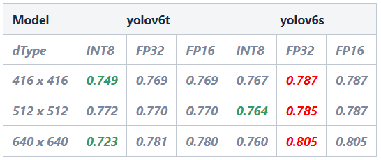
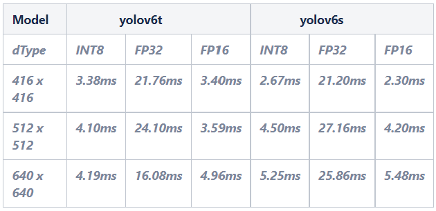
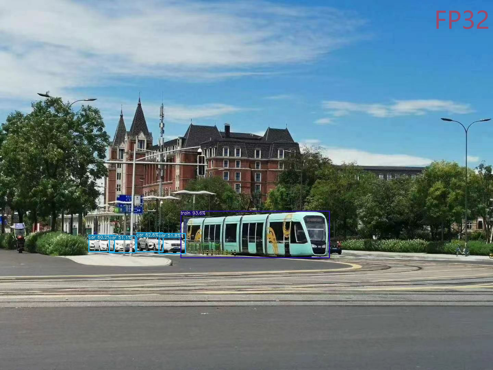
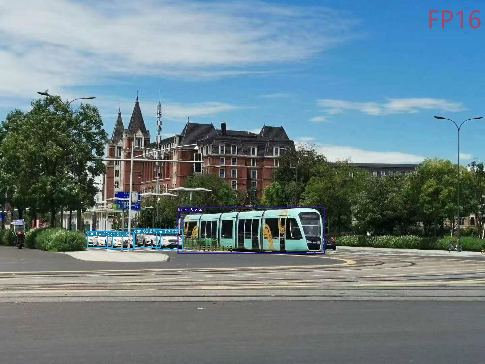

# YOLOv6 训练模型使用TensorRT量化加速  by m.q

## 环境配置需求
- TensorRT - 8.2.3.0 及以上版本
- OpenCV - 4.1.0 及以上版本

## Step 1: 转换训练模型为ONNX模型
进入文件夹 ONNX 使用 export_onnx.py 按照以下命令将 .pt 模型转化为 .onnx 模型 \
**需要注意的是:目前不支持使用 --end2end 转换带有NMS功能的onnx模型**

```shell
python ./deploy/ONNX/export_onnx.py \
    --weights yolov6n.pt \
    --img 640 \
    --batch 1
```

## Step 2: 转换ONNX模型为TensorRT engine 模型
进入文件夹 TensorRT 使用 onnx_to_tensorrt.py 按照以下命令将 .onnx 模型转化为 .trt engine 模型

```shell
python3 onnx_to_tensorrt.py --fp16 --int8 -v \
        --max_calibration_size=${MAX_CALIBRATION_SIZE} \
        --calibration-data=${CALIBRATION_DATA} \
        --calibration-cache=${CACHE_FILENAME} \
        --preprocess_func=${PREPROCESS_FUNC} \
        --explicit-batch \
        --onnx ${ONNX_MODEL} -o ${OUTPUT}
```

## Step 3: 创建demo：
如果没有安装TensorRT，请按照[TensorRT Installation Guide](https://docs.nvidia.com/deeplearning/tensorrt/install-guide/index.html)安装TensorRT \
同时，需要在CMakeLists.txt中配置TensorRT的路径和CUDA的路径 \
如果不是使用的COCO数据集，请在yolov6.cpp文件中，根据训练集修改参数:种类数量，图片高宽以及种类名称，下面为详细信息:
```c++
const int num_class = 80;
static const int INPUT_W = 640;
static const int INPUT_H = 640;
static const char* class_names[] = {
        "person", "bicycle", "car", "motorcycle", "airplane", "bus", "train", "truck", "boat", "traffic light",
        "fire hydrant", "stop sign", "parking meter", "bench", "bird", "cat", "dog", "horse", "sheep", "cow",
        "elephant", "bear", "zebra", "giraffe", "backpack", "umbrella", "handbag", "tie", "suitcase", "frisbee",
        "skis", "snowboard", "sports ball", "kite", "baseball bat", "baseball glove", "skateboard", "surfboard",
        "tennis racket", "bottle", "wine glass", "cup", "fork", "knife", "spoon", "bowl", "banana", "apple",
        "sandwich", "orange", "broccoli", "carrot", "hot dog", "pizza", "donut", "cake", "chair", "couch",
        "potted plant", "bed", "dining table", "toilet", "tv", "laptop", "mouse", "remote", "keyboard", "cell phone",
        "microwave", "oven", "toaster", "sink", "refrigerator", "book", "clock", "vase", "scissors", "teddy bear",
        "hair drier", "toothbrush"
    };
```
如果已经完成以上步骤，根据下面步骤创建demo:

```shell
cd ${destination folder}
mkdir build
cd build
cmake ..
make
```
创建demo之后，按照下面命令测试demo:
```shell
./yolov6 -e ../you.engine -s image_source -o ../your output file
```
可以得到测试图片，推理时间和平均mAp值等相关结果;

## YOLOv6 s/t 模型测试结果(部分)：
使用yolov6 s/t .pt 模型转换为相对 .trt engine \
且在[416,416]，[512,512]，[640,640]的图片输入尺寸下，做了对比实验 \
其部分实验结果见下:
### mAp值:
<div align="center">
    <a href="./">
        
    </a>
</div>

### 推理时间:
<div align="center">
    <a href="./">
        
    </a>
</div>

### v6s trt engine 的640尺寸的推理结果图对比:

<center calss="third">
    
    
    
</center>

